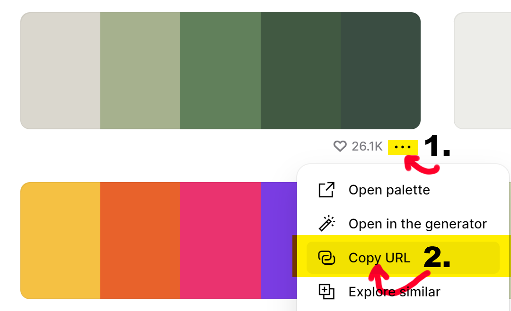

## Description

If the script is active, when a link starting with https://coolors.co/palette/ is being copied to the clipboard, the clipboard content is changing to an array of colors in the palette which URL was copied.

### Example

When we copy the following link: `https://coolors.co/palette/cdb4db-ffc8dd-ffafcc-bde0fe-a2d2ff`

The clipboard content changes to: `["#cdb4db", "#ffc8dd", "#ffafcc", "#bde0fe", "#a2d2ff"]`

## Usage

To use this script, run the following command in the terminal: `python modifier.py`
If you want to stop the script, use `CTRL + C` in the terminal.

### Copying
To copy a link to the palette on https://coolors.co/:
1. Click on the 3 dots
2. Click "Copy the link"
